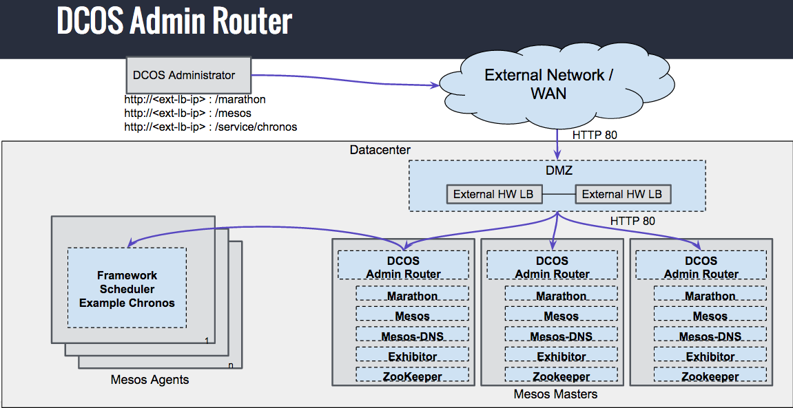
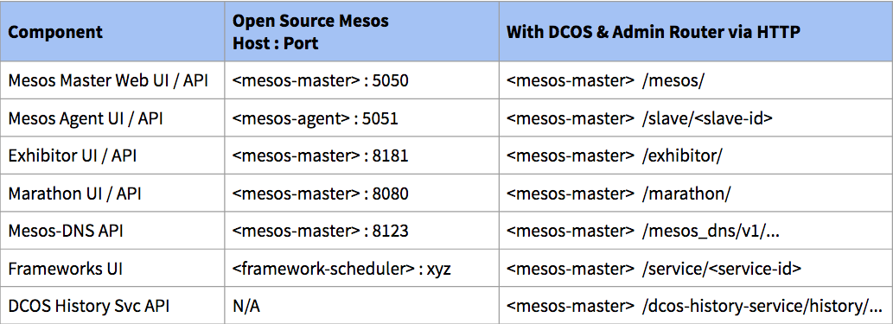
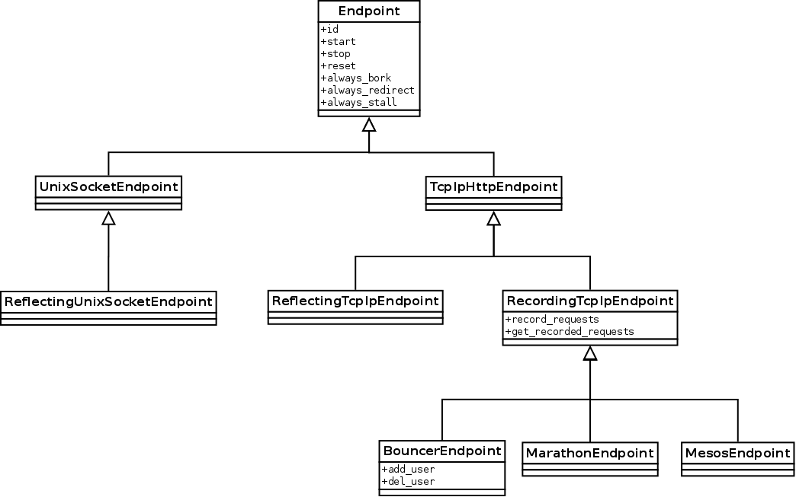

# Admin Router

Admin Router is an open-source Nginx configuration created by
Mesosphere that provides central authentication and proxy to DC/OS services
within the cluster.



## Ports summary


## Service Endpoints

Admin Router allows Marathon tasks to define custom service UI and HTTP endpoints, which are made available via `<dcos-cluster>/service/<service-name>`. This can be achieved by setting the following Marathon task labels:

```
"labels": {
    "DCOS_SERVICE_NAME": "service-name",
    "DCOS_SERVICE_PORT_INDEX": "0",
    "DCOS_SERVICE_SCHEME": "http"
  }
```

In this case `http://<dcos-cluster>/service/service-name` would be forwarded to the host running the task using the first port allocated to the task.

In order for the forwarding to work reliably across task failures, we recommend co-locating the endpoints with the task. This way, if the task is restarted on a potentially other host and with different ports, Admin Router will pick up the new labels and update the routing. NOTE: Due to caching there might be an up to 30-second delay until the new routing is working.

We would recommend having only a single task setting these labels for a given `service-name`.
In the case of multiple task instances with the same `service-name` label, Admin Router will pick one of the tasks instances deterministically, but this might make debugging issues more difficult.

The endpoint should only use relative links for links and referenced assets such as .js and .css files. This is due to the fact, that the linked resources will be reachable only in their relative location `<dcos-cluster>/services/<service-name><link>`.

Tasks running in nested [Marathon app groups](https://mesosphere.github.io/marathon/docs/application-groups.html) will be available only using their service name (i.e, `<dcos-cluster>/service/<service-name>`) and not considering the marathon app group name (i.e., `<dcos-cluster>/service/app-group/<service-name>`).

## Caching

In order to serve some of the requests, Admin Router relies on the information
 that can be obtained from Marathon and  Mesos. This includes:
* Mesos agents - e.g. `/agent/.*` location
* Marathon leader - e.g. `/system/v1/leader/marathon/.*` location
* Tasks/Frameworks running in the cluster - e.g. `/service/.*` location

Due to scalability reasons, it's impossible to obtain this data on each and
every request to given endpoint as it will overload Mesos/Marathon. So
the idea was born to pre-fetch this data and store it in shared memory where
each Nginx worker process can access it.

### Architecture

Due to the nature of Nginx, there are some limitations when it comes to Lua
code that OpenResty can run. For example:
* threading is unavailable, it's recommended to use recursive timers (http://stackoverflow.com/a/19060625/145400) for asynchronous tasks
* it's impossible to hold back Nginx request processing machinery from within
  certain initialization hooks as workers work independently.
* Using ngx.timer API in `init_by_lua` is not possible because init_by_lua runs
  in the Nginx master process instead of the worker processes which does the
  real request processing, etc. (https://github.com/openresty/lua-nginx-module/issues/330#issuecomment-33622121)

So a decision was made to periodically poll Mesos and Marathon for relevant data
using recursive timers. There are two variables that control this behaviour:
* `CACHE_FIRST_POLL_DELAY` - first poll for Mesos and Marathon occurs after this
  amount of time passed since worker initialization
* `CACHE_POLL_PERIOD` - after the first poll is done, every other is scheduled
  every this number of seconds.
Obviously `CACHE_FIRST_POLL_DELAY` should be much smaller than `CACHE_POLL_PERIOD`.

Cache refresh can also be triggered by a request coming in during
<0, `CACHE_FIRST_POLL_DELAY`> period. In this case, cache refresh will not occur
during the `CACHE_FIRST_POLL_DELAY` timer execution as the contents of the
shared memory will still be considered fresh.

### Cache timers

The `freshness` of the cache is governed by few variables:
* `CACHE_EXPIRATION` - if the age of the cached data is smaller than
  `CACHE_EXPIRATION` seconds, then the cache refresh will not occur if it's
  ngx.timer context and request processing code will use the data stored in shared memory.
* `CACHE_MAX_AGE_SOFT_LIMIT` - between `CACHE_EXPIRATION` seconds and
  `CACHE_MAX_AGE_SOFT_LIMIT` seconds, cache is still considered "usable" in
  request context, but the ngx.timer context will try to update it with fresh
  data fetched from Mesos and Marathon
* `CACHE_MAX_AGE_HARD_LIMIT` - between `CACHE_MAX_AGE_SOFT_LIMIT` and
  `CACHE_MAX_AGE_HARD_LIMIT` cache is still usable in request context, but
  with each access to it, a warning message is written to the Nginx log.
  Timer context will try to update the cache.
* beyond `CACHE_MAX_AGE_HARD_LIMIT` age, cache is considered unusable and
  every request made to the location that uses it will fail with 503 status.

The relation between these is:
`CACHE_EXPIRATION` < `CACHE_MAX_AGE_SOFT_LIMIT` << `CACHE_MAX_AGE_HARD_LIMIT`

The reason why we put `<<` in front of `CACHE_MAX_AGE_HARD_LIMIT` is to make
the cache a bit of a "best-effort" one - In the case when Mesos and/or Marathon
dies, the cache should still be able to serve data for a reasonable amount of time
and thus give the operator some time to solve the underlying issue. For example
Mesos tasks do not move that often and the data stored in Nginx should still be
usable, at least partially.

### Locking and error handling

Each worker tries to perform cache updates independently. On top of that during
the early stage of Admin Router operation, a request can trigger the update as
well. In order to coordinate it, locking was introduced.

There are two different locking behaviours, depending on the context from which
the update was triggered:
* for timer-based refreshes, the lock is non-blocking. If there is an update already
  in progress, execution is aborted, and next timer-based refresh is scheduled.
* in case of request-triggered update, lock is blocking and the lock timeout
  is equal to `CACHE_REFRESH_LOCK_TIMEOUT` seconds. This way, during
  `<0, CACHE_FIRST_POLL_DELAY>` period, requests are queued while waiting for the
  first, refresh to succeed.

Request to Mesos/Marathon can take at most `CACHE_BACKEND_REQUEST_TIMEOUT` seconds.
After that, the request is considered failed, and it is retried during the next
update.

Worth noting is that Nginx reload resets all the timers. Cache is left intact
though.

## Testing

Admin Router repository includes a test harness that is meant to make
testing easier and in some cases - possible. It's written in Python and
uses pytest fixtures and custom modules to mock out all relevant DC/OS
features and control Nginx startup and termination.

All the tests are executed in a Docker container which is controlled by the
Makefile. Inside the container pytest command is started which in turn pulls
in all the relevant fixtures, such as Syslog mock, mocker (DC/OS endpoints
mock), DNS mock, etc... Finally, an Nginx is spawned using the configuration
bind-mounted from the developer's repository. Tests may launch Nginx multiple
times, in different configurations, depending on what is needed. After the
tests runner finishes, all the processes and the environment is cleaned up
by pytest.

Below, there is a general overview of all the components of the test harness.
More detailed documentation can be found in docstrings and comments in the code
itself. If in doubt, it also may be very helpful to look for examples among
existing tests.

### Quickstart
To execute all the tests, just issue:

	make test

In order have fine-grained control over the pytest command, execute:

	make shell

This command will launch an interactive environment inside the container that
has all the dependencies installed. The developer may now run the `pytest`
command as need, debug the environment and temporarily add/change
the dependencies.

### Makefile
Makefile provides an easy way to start the testing environment without the need
to worry about the correct docker commands. Its core concept is `adminrouter-devkit`
container which is contains all the dependencies that are needed to run
Admin Router, and inside which all tests-related commands are run.

It exposes a couple of targets:
* `make clean` - remove all containers created by the test harness. It does not
  remove the images themselves though as the layer cache may be useful later
  on and the user may remove them themselves.
* `make devkit` - creates the `adminrouter-devkit` container. By default other
   targets execute this step automatically if devkit container image does not
   exist yet.
* `make update-devkit` - updates `adminrouter-devkit`. Should be run every time
   the Dockerfile or its dependencies change.
* `make tests` - launch all the tests. Worth noting is the fact that McCabe
   complexity of the code is also verified, and an error is raised if it's
   equal to or above 10.
* `make shell` - launch an interactive shell within the devkit container. Should
  be used when fine grained control of the tests is necessary or during debugging.
* `make flake8` - launch flake8 which will check all the tests and test-harness
  files by default.

### Docker container
As mentioned earlier, all the commands are executed inside the `adminrouter-devkit`
container. It follows the same build process for Nginx that happens during
DC/OS build with the exception of setting the  `--with-debug` flag. It also
contains some basic debugging tools, pytest related dependencies and
files that help pytest mimic the DC/OS environment. Their location is then
exported via environment variables to the pytest code, so changing their location
can be done by edition only the Dockerfile.

Due to some issues with overlayfs on older kernels, the container links
/tmp directory to /dev/shm.

### Repository flavours
Admin Router repository can come in two variants/flavours - Enterprise and Opensource.
Tests determine it basing on the directory structure - if tests contain
`test-harness/tests/open/` directory then the repo is treated as Opensource one,
and in case when `test-harness/tests/ee/` directory is present - as the
enterprise one. Pytest fixture `repo_is_ee` takes care of it and is pulled in
as dependencies by all the fixtures that need this information.

### Service startup ordering and cleanup
Mocking out DC/OS is a complex task, and a huge part in it have pytest
fixtures. They take care of proper ordering of mocks and subprocess start/stop and
cleanup and the cleanup ordering itself.

Tracking the chain of fixtures and how they use each other may provide better
understanding of how the test harness works.

### JWT
DC/OS IAM relies on JSON Web Tokens for transmitting security information between DC/OS
components. Open repository flavour uses HS256 tokens, while EE relies on RS256.
Test harness needs to have a way to create them for use in the tests. This is
done by `test-harness/modules/mocker/jwt.py` module, which together with
`repo_is_ee` fixture provides abstracts away the type of the
token used by Admin Router itself.

### Mocker
Mocker takes care of simulating DC/OS HTTP endpoints that Admin Router uses. It's
basically just a thin management layer on top of multiple python-based
HTTP servers, each one of them mocking out particular component/upstream of DC/OS.

It exposes the `.send_command()` method that allows to reconfigure endpoints
the way the tests need it. It calls a getattr on the endpoint
instance to execute the given function and pass it attributes as specified
by the `.send_command()` call arguments. Please see the function signature in
the file `test-harness/modules/mocker/common.py` for details.

#### Endpoints
Endpoints are threading HTTP servers based on http.server python module. Because
of the fact that there are many different kinds of endpoints that need to be
employed by mocker, and that there is a lot of shared behaviour between them,
they follow inheritance tree as below:



* `ReflectingUnixSocketEndpoint`, `ReflectingTCPIPEndpoint`: both of them send back
  the request data in the response body to the client for inspection. The only
  difference between them is that the former is listening on Unix Socket
  and the latter is listening on TCP/IP socket. They are useful for very simple
  tests that only check if the request is hitting the right upstream and the
  headers are correct.
* `IAMEndpoint`, `MarathonEndpoint`, `MesosEndpoint`: specialized endpoints that
  are mimicking IAM, Marathon and Mesos respectively. Apart from the basic
  functionality (reset, bork, etc...), they are also capable of recording requests
  sent to them, and then returning them through mockers `send_command` back to the
  tests code.
* all remaining endpoints depicted in the hierarchy are not directly usable but
  can be inherited from and extended if necessary for the purposes of testing.

Each endpoint has an id, that it basically it's http address (i.e.
`http://127.0.0.1:8080` or `http:///run/dcos/dcos-metrics-agent.sock`). It's
available via the `.id()` method. They are started and stopped via `.start()`
and `.stop()` methods during the start and stop of mocker instance
respectively. Each endpoint can be set to respond to each and every request
with an error (`500 Internal server error`).

#### Subprocess management
Pytest fixtures start a couple of subprocesses:
* two dnsmasq instances
* Admin Router itself

These do not always log to stderr/stdout, so a very simple syslog mock is also
provided. All the stdouts and stderrs are piped into the central log
processing class LogCatcher.

##### LogCatcher
As mentioned in the previous paragraph, all the stdout/stderr file descriptors
and syslog messages are piped into this class. It uses `poll()` call to monitor
all the sources for new information and push it into:
* standard python logging module
* logs located in `test-harness/logs/`
* internal buffer which can be used by tests for logging-based testing

The internal buffer is available through
`stdout_line_buffer`/`stderr_line_buffer` methods of AR object, Syslog
object(available through a fixture), and dnsmasq processes (also through
fixture). The buffer itself is implemented as a plain python list where each
log line represents a single entry. This list is shared across all the objects
that are groking the buffer, and there is no extra protection from manipulating
it from within tests so extra care needs to be taken.

In order to simplify handling of the log lines buffers, `LineBufferFilter` class
has been created. It exposes two interfaces:
* context manager that allows for groking the buffer entries that were created
  while executing the context:

  ```
    filter_regexp = 'validate_jwt_or_exit\(\): User not found: `{}`'.format(uid)
    lbf = LineBufferFilter(filter_regexp,
                           line_buffer=master_ar_process.stderr_line_buffer)
    with lbf:
        resp = requests.get(url,
                            allow_redirects=False,
                            headers=header)
    assert lbf.extra_matches == {}

  ```
* `scan_log_buffer()` method that scans all the entries, since the subprocess
  start.
  ```
    filter_regexp = 'Secret key not set or empty string.'

    lbf = LineBufferFilter(filter_regexp,
                           line_buffer=ar_process_without_secret_key.stderr_line_buffer)

    lbf.scan_log_buffer()

    assert lbf.extra_matches == {}

  ```
Separation of the log entries stemming from different instances of a given
Subprocess class in the logfile is done by placing the following line in the log
file:
```
✄✄✄✄✄✄✄✄✄✄ Logging of this instance ends here ✄✄✄✄✄✄✄✄✄✄

```

##### DNS mock
It's easier to launch dnsmasq process that will serve a static entries from a
`/etc/hosts.dnsmasq` file than to write a fully conforming dns server in python.
All the entries in this file point to localhost where appropriately configured
endpoints are listening for connections, even though in real DC/OS instance
they would point to a different server/IP address.

Dnsmasq processes log all the requests to stdout which in turn is pushed into
LogCatcher instance.

##### Syslog mock
Syslog mock is a very simple Python hack - a DGRAM Unix Socket is created and
added to LogWatcher. LogWatcher itself takes care of draining data from it,
with the line length limit hard-coded to 4096 bytes.

##### Nginx
The Nginx subprocess is different from others in regard to its lifetime. Pytest
fixture that pulls it into the test is module-scoped by default. If there is a
need to have custom lifetime or just single-test scoped lifetime, then it's
necessary to use `nginx_class` fixture instead of simple `master_ar_process` or
`agent_ar_process` ones.

Nginx instances have the `.make_url_from_path` method which is a convenient way
to generate AR URLs for tests. It uses exhibitor endpoint as it's present in
all DC/OS configurations and uses auth features as well.

#### pytest tests
Directly from the fact that Admin Router subprocess fixture is module scoped,
stems some of the current structure of the tests directory. There are three
different files where tests reside:
* `test_agent.py`: all the tests related to agent Admin Router, which do not
  require custom AR fixtures
* `test_master.py`: all the tests related to master Admin Router, which do not
  require custom AR fixtures
* `test_boot_envvars.py`: tests that verify adminrouter startup variables

`test_agent.py` and `test_master.py` may be splitted apart into smaller units,
but with each unit an extra start and stop of AR master or agent is required.
This slows down the tests. Running session-scoped AR is impossible. For now,
each endpoint has tests grouped on class level.

Test files are grouped into repository flavour directories, which
group the tests that are specific for given version:
* `test-harness/modules/ee/test_*.py` for Enterprise
* `test-harness/modules/open/test_*.py` for Open
* `test-harness/tests/test_*.py` common for both variants

#### Debugging threads-related issues
The fixtures, mocks, and all other features make the code heavily threaded. In
order to simplify debugging a special signal handler is installed. It launches a
pdb sessions when USR1 signal is received.

Code also relies on thread safety/atomicity of some of Python's
expressions/statements:

    https://docs.python.org/3.6/faq/library.html#what-kinds-of-global-value-mutation-are-thread-safe

This is why the context of each endpont is not protected by locks, in
case when it's only about fetching a single value from context dict or
storing/appending one there.
