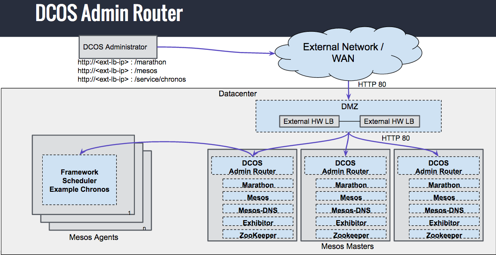
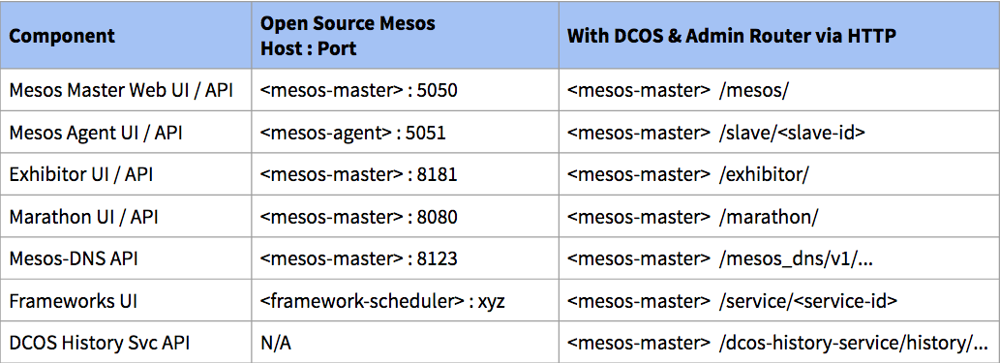
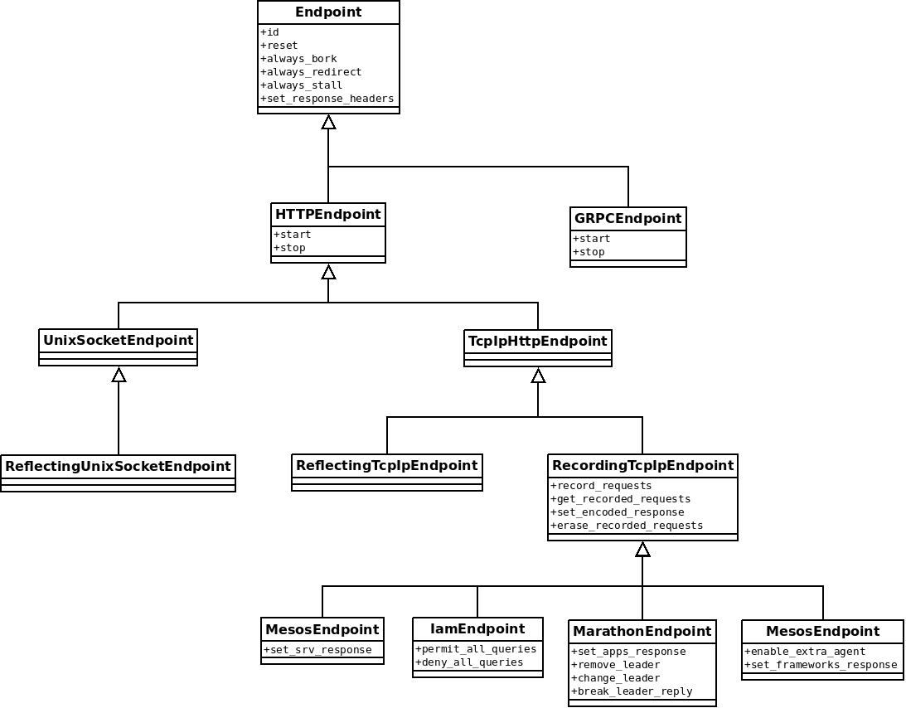

# Admin Router

Admin Router on DC/OS master nodes ("Master Admin Router") proxies HTTP requests
from outside the DC/OS cluster to the individual DC/OS services inside the
cluster. It is meant to be used by cluster operators for configuring and
debugging the DC/OS cluster state, and for starting and configuring services in
the cluster. It is not meant to proxy heavy web traffic to individual services
or applications running in the DC/OS cluster.

Admin Router implements acentral authentication mechanism. That is, HTTP
requests typically need present authentication proof so that Admin Router
actually proxies them instead of responding with a 401 HTTP response.



## Routes

Admin Router runs on both DC/OS master and DC/OS agent nodes, each with
different NGINX configurations. From these NGINX config files,
[ngindox](https://github.com/karlkfi/ngindox) is used to generates Swagger-like
documentation:

**Master Routes:**

- NGINX: [nginx.master.conf](nginx.master.conf)
- YAML: [docs/api/nginx.master.yaml](docs/api/nginx.master.yaml)
- HMTL: [docs/api/nginx.master.html](docs/api/nginx.master.html)
- Rendered: <https://rawgit.com/dcos/dcos/master/packages/adminrouter/extra/src/docs/api/nginx.master.html>

**Agent Routes:**

- NGINX: [nginx.agent.conf](nginx.agent.conf)
- YAML: [docs/api/nginx.agent.yaml](docs/api/nginx.agent.yaml)
- HMTL: [docs/api/nginx.agent.html](docs/api/nginx.agent.html)
- Rendered: <https://rawgit.com/dcos/dcos/master/packages/adminrouter/extra/src/docs/api/nginx.agent.html>


## Endpoint documentation

All Admin Router endpoints are documented using the
[ngindox](https://github.com/karlkfi/ngindox) tool, which uses specially
formatted comments in order to describe endpoint configurations, and
automatically parses them into HTML documents. Please check the project's
documentation for more details.

Admin Router's CI automatically checks if the endpoint documentation generated
using `ngindox` and embedded into the repository is up to date. If not, the CI
job fails and the user needs to regenerate the docs and re-submit the PR.

The check is done by generating the documentation during the build stage.
If, after the `ngindox` run, `git` detects uncommitted changes, then this means
that the Admin Router configuration differs from the HTML documents that
are committed into repository. This is done using `make check-api-docs` target.

In order to regenerate the documentation files, one needs to execute the
`make api-docs` target and commit the changes into the repository.

## Ports summary


## Repository structure

There are two Admin Router "flavours" residing in DC/OS repos:
  * Opensource version or `Open` in short
  * Enterprise version or `EE` in short

The `Open` version is the base on top of which `EE` version is built. `EE` is in
fact an overlay on top of `Open`, it re-uses some of its components.

### Complexity vs. code re-use
It is crucial to understand that the more generalised the AR repositories
are, the more complicated they will become. Increased complexity will result in
people making mistakes and/or situations where complex rules are violated in
favour of development speed and thus copypasting code. It's all about striking
the right balance so sometimes code *is* duplicated between repositories in order
to make it easier for contributors to work with repositories.

### NGINX includes
All AR code, both Lua and non-Lua, can be divided into the following groups:

 * common code for masters and agents, both EE and Open
 * agent-specific code, both EE and Open
 * master-specific code, both EE and Open
 * Open-specific code, both agent and master
 * EE-specific code, both agent and master
 * EE agent specific code
 * EE master specific code
 * Open agent specific code
 * Open master specific code

on top of that, NGINX-specific configuration is divided into three sections:

 * main
 * http
 * server

This gives us in total 27 possible "buckets" for NGINX directives. The
differentiation between sections could be avoided if we decide to use some more
advanced templating but this would further complicate configuration and
make it more difficult for people to test, and develop AR on live clusters.

Directly from it, stems the idea how the NGINX includes can be structured:

* open:

```
includes
├── http
│   ├── agent.conf
│   ├── common.conf
│   ├── master.conf
│   └── open
│       ├── common.conf
│       └── master.conf
├── main
│   ├── common.conf
│   └── open
│       └── common.conf
├── server
│   ├── common.conf
│   ├── master.conf
│   └── open
│       ├── agent.conf
│       └── master.conf
├── snakeoil.crt
└── snakeoil.key
```

* ee:

```
includes
├── http
│   └── ee
│       ├── common.conf
│       └── master.conf
├── main
│   └── ee
│       └── common.conf
└── server
    └── ee
        ├── agent.conf
        ├── common.conf
        └── master.conf
```

All the NGINX related configuration directives reside in the `includes`
directory which contains directories reflecting all the sections present in
NGINX configuration (http|main|server). Because they are always present, no
matter the flavour/server type, they are chosen as top-level directories in the
`includes` directory. The `common.conf`, `agent.conf` and `master.conf` files
are flavour-agnostic, thus they reside in each section's main directory and are
present only in the Open DC/OS repository. The EE repository re-uses them after
being applied on top of the Open DC/OS repository. Contents of each of the
files are as follows:
 * `common.conf` contains all the things that are common across all flavours
   and server types for given section
 * `agent.conf` contains all the things that are common for all agents across
   all flavours
 * `master.conf` contains all the things that are common for all masters across
   all flavours

Each section can have either `ee` or `open` directories, but never both. `ee`
directory is only present in EE repository, Open repository contains only `open`
directories. Contents of these directories may be as follows:
 * `common.conf` contains all the things that are common for given flavour, no
   matter the server type
 * `agent.conf` contains all the things that are common for agents in given
   flavour
 * `master.conf` contains all the things that are common for masters in given
   flavour

The order of includes is for the time being hard-coded in `nginx.\*.conf` files.
Within particular section though it does not matter that much as:
 * [nginx by default orders the imports while globing](https://serverfault.com/questions/361134/nginx-includes-config-files-not-in-order)
 * location blocks *MUST NOT* rely on the order in which they appear in the
   config file and define matching rules precise enough to avoid ambiguity.

All the includes are bound together by `nginx.(master|agent).conf` files.
`nginx.master.conf` for `Open` master looks like at the time of writing:
```
include includes/main/common.conf;
include includes/main/open/common.conf;

http {
    include includes/http/common.conf;
    include includes/http/master.conf;
    include includes/http/open/common.conf;
    include includes/http/open/master.conf;

    server {
        server_name master.mesos leader.mesos;

        include includes/server/common.conf;
        include includes/server/master.conf;
        include includes/server/open/master.conf;

        include /opt/mesosphere/etc/adminrouter-listen-open.conf;
        include /opt/mesosphere/etc/adminrouter-upstreams-open.conf;
        include /opt/mesosphere/etc/adminrouter-tls.conf;
    }
}
```
and for the agent:
```
include includes/main/common.conf;
include includes/main/open/common.conf;

http {
    include includes/http/common.conf;
    include includes/http/agent.conf;
    include includes/http/open/common.conf;

    server {
        server_name agent.mesos;

        include includes/server/common.conf;
        include includes/server/open/agent.conf;

        include /opt/mesosphere/etc/adminrouter-listen-open.conf;
        include /opt/mesosphere/etc/adminrouter-tls.conf;
    }
}
```

### Enforcing code reuse
The EE repository contains only EE directories, all
common/agent-common/master-common code resides in Open repository. This way EE
repository becomes an overlay on top of Open. Only `nginx.(master|agent).conf`
are overwritten while applying EE repository on top of Open during DC/OS image
build. EE DC/OS image build scripts remove all open directories from the Open
repository before applying the EE repository on top of it.

This is not a bulletproof solution for preventing code
duplication (developers can simply start putting copies of code to both
`open/` and `ee/` directories) but it makes it easier to reuse the
code and encourages good behaviours.

### Lua code deduplication
It is not required to provide the same level of flexibility for Lua code as it
is the case for NGINX includes and thus it's possible to simplify the code a
bit. It is sufficient to just differentiate Lua code basing on the repository
flavour.  Both agents and masters can share the same Lua code.

There are two possible reasons that may be preventing Lua code from being
shared:
* the same code is executed but with different call arguments. An example to
  this may be `auth.validate_jwt_or_exit()` function. In the Open repository it
  takes no arguments, in EE it takes more than one.
* the code differs between EE and open but shares some common libraries/functions.
  Great example for this is `auth.check_acl_or_exit()` which internally, among
  many other things, calls argument-less `auth.check_jwt_or_exit()`.

In order to address these issues, a couple of patterns were selected:
 * modules which have flavour-specific function arguments export argument-less
   functions for the NGINX configuration. They translate the original call into
   a call with correct arguments. This approach requires splitting the module
   into `ee.lua|open.lua|common.lua` parts which is described in the next
   bullet point.  Depending on the flavour, either `ee.lua` or `open.lua` is
   imported and the correct argument-less function is used. This approach also
   enables to share some of the NGINX `location` blocks between flavours -
   `location` code is the same, even though the Lua code used by the block
   differs.
 * some libraries/functions are structured in a way that extracts parts common
   among both flavours and `ee/open` parts that are included only in EE and
   Open repos respectively. An example of this approach is `auth.lua` library
   which is splitted into three parts:
    * `lib/auth/common.lua` - present only in Open repository, with functions
      shared by both EE and Open code.
    * `lib/auth/ee.lua` - present only in EE repository, with functions specific
      to EE that use boilerplate from lib/auth/common.lua.
    * `lib/auth/open.lua` - as above but for Open repository.
   `init_by_lua` OpenResty call in `includes/http/(open|ee)/common.conf`
   imports `auth.open` or `auth.ee` modules as auth respectively.  The module
   is registered in the global namespace so all other Lua code uses it. This
   approach also allows for some degree of code separation enforcement as lua
   libs from Open DC/OS repository are removed during the application of EE
   DC/OS repository.

A special case of the "same code path, different call arguments"
problem is when a module needs to be initialized differently depending
on the flavour. A great example of it is `cache.lua` module which in Open
does not require any extra authentication data. To solve it, modules are
required to provide `.init()` function which is returned by require
`<module-name>` statement. The init function accepts arguments which
reconfigure module instance according to the flavour requirements.

Modules that do not require any customization in regards of flavour are left
as-is/usually do not follow any of these patterns. It is possible to standardise
it, but it does not seem to be justified. For example:
 * `util.lua` directly exposes its functions as they are stateless and shared
   between both flavours
 * `lib/auth/open.lua` uses the `.init()` pattern in order to achieve different
   behaviour depending on the flavour.

## Service Endpoint
Admin Router offers the `/service` endpoint which enables users to easily
access some of the tasks launched on DC/OS. AR internally pre-fetches data from
Mesos and root Marathon and stores it in the internal cache for later use when
routing an incoming request.

Marathon tasks can be accessed by application ID, Mesos frameworks can be
accessed by application ID or by framework ID. For example - let's deploy a
SchmetterlingDB framework with application ID of
`/group1/group2/schmetterlingA`. It will be accessible using its framework ID
(let's assume that Mesos assigned it a framework ID of
`819aed93-4143-4291-8ced-5afb5c726803-0000`):
```
/service/819aed93-4143-4291-8ced-5afb5c726803-0000/
```
and using its application ID:
```
/service/group1/group2/schmetterlingA/
```

The `/service` endpoint supports WebSockets. By default, it disables NGINX
request and response buffering. All redirects from services are rewritten in
order to support the `/service` URL path prefix clients are using.

### Intended use
It is important to remember that the `/service` endpoint was designed to work
with root Marathon only. Tasks launched by Marathon-on-Marathon instances will
not be reachable via it.

In the case of Mesos frameworks, this becomes a bit more complex - all the
frameworks are visible in Mesos' `/state-summary` endpoint output so in theory
it is possible to access a framework launched using Marathon-on-Marathon or by
hand.  Unfortunately, Mesos as of now does not enforce framework name
uniqueness and thus it is possible to launch multiple frameworks with the same
name. AR in such case will route in a non-deterministic manner. Root Marathon
by default enforces unique names for all the tasks and frameworks it has under
control.

Please check the [Limitations](#limitations) section for more details.

### Operation
Under the hood, the `/service` endpoint implementation uses non-trivial logic in
order to resolve the cluster-internal socket address to route the HTTP request
to.

#### Iterative resolving
There is no way to tell which part of the path is the application ID and
which one is just a resource address. For example, assuming that the request
path is `/foo/bar/baz/picture.jpg` we can have:
* application ID: `foo`, resource address: `/bar/baz/picture.jpg`
* application ID: `foo/bar`, resource address: `/baz/picture.jpg`
* application ID: `foo/bar/baz`, resource address: `/picture.jpg`
* application ID: `foo/bar/baz/picture.jpg`, resource address: `/`

So the algorithm iteratively tries to resolve each "candidate" namespace and
name and assumes that first-match wins.

Assuming that we deployed an NGINX task with application ID `foo/bar`, we will
see two iterations:
* The first one with `foo` candidate application ID, which is not present in
  the cluster
* The second one with `foo/bar` candidate application ID, which results in the
  request being routed to the correct backend. In the case when user is trying
  to access a non-existent service, there are going to be four iterations, each
  one unsuccessful. After the fourth one the code will give up.

There is a limit on the number of iterations that AR makes. At the time of
writing, it is set to `10`. This means that an application ID cannot nest more
than ten times and that everything after the tenth segment is always treated as
a resource component.

#### Resolving individual components
During each iteration described in [previous paragraph](#iterative-resolving),
AR tries to resolve the component using the data stored in the cache and if
necessary - from MesosDNS:
* first step is to:
  * check if a root Marathon task has the following labels set:
    * `DCOS_SERVICE_NAME` label contents is equal to given application ID string
    * `DCOS_SERVICE_SCHEME` label is set
    * `DCOS_SERVICE_PORT_INDEX` label is set
  * task is in the state `TASK_RUNNING`.
  If all the conditions are met then the request is routed using root Marathon
  data. Please check the [section below](#recommended-way-to-expose-services)
  for details on the meaning of these labels.
* if the name of the service couldn't be resolved using root Marathon data, AR
  scans the list of Mesos frameworks in search for the one with either
  framework ID (higher priority) or framework name(lower priority) equal to
  application ID string. If found, the next steps depend on the value of
  `webui_url` field:
  * field contains an empty string - algorithm tries to resolve the application
    ID using MesosDNS
  * field is `null` - resolving process for given application ID ends, MesosDNS
    step is NOT executed
  * field contains a valid address - request is proxied to the address pointed
    by the field contents
* resolving via MesosDNS relies on issuing an HTTP SRV query to MesosDNS. For
  application ID string equal to `foo/bar/baz`, the request that is going to be
  made to MesosDNS is:
  ```
  http://localhost:8123/baz.bar.foo._tcp.marathon.mesos
  ```
  In the case where MesosDNS returns no results, AR assumes that there is no
  task nor framework with the given application ID running on DC/OS.

A bit of a special case is `/service/marathon` and `/service/metronome`. They
will never be present in Root Marathon's taks list hence we skip the first step
of the iteration. The reason for that is the fact that these frameworks are
launched on Master nodes using systemd. This improves the reliability a bit as
the failure of the local Root Marathon/Root Metronome does not prevent
`/service` entpoint to route to the healthy leader running on some other hosts
(provided that there is a leader).

#### Stale cache/broken cache cases
The `/service` endpoint internally uses the AR cache, so a failure to refresh
the cache has the same effects on the `/service` endpoint like any other
endpoint. Please check the [Cache timers](#cache-timers) section for details.

The thing worth remembering though, is that this endpoint uses more than one
cache entry. Because of that, if for example root Marathon fails, and Mesos is
fine, requests will not be routed. This is because there has to be a strict
priority enforcement, and without root Marathon, it is impossible to decide
whether AR should use Mesos data or not and request routing becomes ambiguous.
The reverse is possible though - a failed Mesos cache update will not prevent
requests from being routed as long as they can be handled *only* using Marathon
data.

### Limitations
Apart from the one mentioned earlier - that the `/service` endpoint should be
routing only to the tasks launched by root Marathon, there is one more
limitation that needs to be kept in mind.

To properly remove a framework, a cleanup procedure needs to be followed:
* the framework needs to be removed from root Marathon
* it needs to be unregistered with Mesos
* ZooKeeper state has to be cleaned up
* Mesos reservations (if any), need to be deleted

Without this cleanup, the Mesos framework will still be present in the output of
`/state-summary` endpoint and thus Admin Router will try to route it instead of
simply replying with a 404. It is impossible for AR to differentiate between
frameworks that:
* have been removed by root Marathon
* become disconnected from Mesos for some reason, but *MAY* come back at some
  point

What is more - continuous installation and removal of a framework using the same
name will cause Mesos to keep entries for them in `/state-summary`. There is no
enforcement of unique framework names, and thus AR will try to route to one of
the frameworks (not necessarily the one that is *really* alive) in an undefined
manner.

Until unique service names are implemented, or a proper cleanup is done by the
client, a workaround is to launch frameworks always with a different name, for
example:
* `/hello-world-1`
* `/hello-world-2`
* `/hello-world-3`
* `/hello-world-4`
* ...

### Recommended way to expose services
Admin Router allows Marathon tasks to define custom service UI and HTTP
endpoints, which are made available via `<dcos-cluster>/service/<application ID>`.
This can be achieved by setting the following Marathon task labels:

```
"labels": { "DCOS_SERVICE_NAME": "application ID", "DCOS_SERVICE_PORT_INDEX": "0", "DCOS_SERVICE_SCHEME": "http" }
```

When your container/task has its own IP (typically when running in a virtual
network), `http://<dcos-cluster>/service/<application ID>` is forwarded to the
container/task's IP using one of the ports in the port mapping or port
definition when USER networking is enabled or one of the discovery ports
otherwise. When your task/container is mapped to the host, it is forwarded to
the host running the task using the one of the ports allocated to the task.
The chosen port is defined by the `DCOS_SERVICE_PORT_INDEX` label.

In order for the forwarding to work reliably across task failures, we recommend
co-locating the endpoints with the task. This way, if the task is restarted on
a potentially different host and with different ports, Admin Router will pick
up the new labels and update the routing. Due to caching there might be an up
to 30-second delay before the new routing is working.

We recommend having only a single task setting these labels for a given
application ID. In the case of multiple task instances with the same
application ID label, Admin Router will pick one of the task instances
deterministically, but this might make debugging issues more difficult.

The endpoint should only use relative links for links and referenced assets such
as `.js` and `.css` files. This is due to the fact that the linked resources will
be reachable only in their relative location
`<dcos-cluster>/services/<application ID><link>`.

### Disabling URL path rewriting for selected applications
Some applications like Jenkins or Artifactory, permit specifying a context path (e.g. `/service/jenkins`) that is used while generating application URLs (both relative and absolute). However, normally Admin Router strips these, and this can lead to breakages, esp. for assets like JavaScript files and images.

It is possible to workaround it by using another another HTTP reverse proxy in the application container which rewrites URLs from / to /service/jenkins. This isn't ideal though, so an extra Marathon label is recognized by Admin Router. If a task has `DCOS_SERVICE_REWRITE_REQUEST_URLS` label set to `false`(string) or `false`(boolean), Admin Router will not strip the context path and the upstream request will be made with the same the URL path as the client request has been made. Please see below for an example of how to enable it in an application definition:

```json
{
  "labels": {
    "DCOS_SERVICE_REWRITE_REQUEST_URLS": "false",
    "DCOS_SERVICE_NAME": "myapp",
    "DCOS_SERVICE_SCHEME": "http",
    "DCOS_SERVICE_PORT_INDEX": "0"
  },
  "id": "/myapp",
  "cmd": "echo \"It works!\" > index.html; /usr/local/bin/python -m http.server $PORT0",
  "container": {
    "type": "DOCKER",
    "volumes": [],
    "docker": {
      "image": "python:3.6.5-stretch"
    }
  },
  "cpus": 0.1,
  "instances": 1,
  "mem": 128,
  "networks": [
    {
      "mode": "host"
    }
  ],
  "portDefinitions": [
    {
      "name": "www",
      "protocol": "tcp",
      "port": 10000
    }
  ]
}
```

This feature is available only for the tasks launched by the root Marathon.

### Disabling request buffering for selected applications
Some applications can not tolerate request buffering while there are others that require it in order to function properly. To support both groups, support for `DCOS_SERVICE_REQUEST_BUFFERING` label was introduced.

If a task has `DCOS_SERVICE_REQUEST_BUFFERING` label set to `false` (string) or `false` (boolean), Admin Router will not perform request buffering for this application. Please see below for an example of how to enable it in an application definition:

```json
{
  "labels": {
    "DCOS_SERVICE_REQUEST_BUFFERING": false,
    "DCOS_SERVICE_NAME": "myapp2",
    "DCOS_SERVICE_SCHEME": "http",
    "DCOS_SERVICE_PORT_INDEX": "0"
  },
  "id": "/myapp2",
  "cmd": "echo \"It works!\" > index.html; /usr/local/bin/python -m http.server $PORT0",
  "container": {
    "type": "DOCKER",
    "volumes": [],
    "docker": {
      "image": "python:3.6.5-stretch"
    }
  },
  "cpus": 0.1,
  "instances": 1,
  "mem": 128,
  "networks": [
    {
      "mode": "host"
    }
  ],
  "portDefinitions": [
    {
      "name": "www",
      "protocol": "tcp",
      "port": 10000
    }
  ]
}
```

This feature is available only for the tasks launched by the root Marathon.

## Authentication and authorization

DC/OS uses the concept of the _DC/OS authentication token_ at the core of its
authentication and authorization features. Admin Router can act as a so-called
DC/OS authenticator but also has extension points to render it into a so-called
DC/OS authorizer. For most DC/OS services Admin Router is the sole (but
sufficient) entity which enforces access control based on authentication proof.

The authenticator and authorizer implementation in Admin Router differs
considerably between its upstream and downstream variants. This documentation
focuses on describing concepts that are common between both variants. For
downstream-specific documentation please consult the README.md file in the
downstream Admin Router repository.

### Authentication

For Admin Router to find the identity of the DC/OS user who issued the request
it looks for a DC/OS authentication token in the request, and it then performs a
token verification procedure (for details please see code comments in
auth/common.lua).

If the authentication token verification procedure succeeded the `uid`
corresponding to the DC/OS user who submitted the request is known and logged
(and used for subsequent processing).

When an HTTP request path requires authentication but when a corresponding HTTP
request does not present a token or does not present a valid token then Admin
Router is specified to respond with an 401 HTTP error response.

### Authorization

Upstream Admin Router performs coarse-grained binary authorization purely based
on the authentication state. That is, those request paths that require
authentication can be fully accessed when valid authentication proof is shown.
No other fine-grained privilege control has been implemented.

### Parameter-less interface

Authorization in downstream is done in a fine-grained fashion. That is, its
implementation differs significantly between the downstream (EE) and upstream
(Open Source) Admin Router variants. At the same time the NGINX location block
configuration in `nginx.*.conf` files usually is very similar in both variants.
To be able to share a lot of code between both variants there is a common
interface which can be used from within these location configuration blocks for
entering the authentication and authorization capabilities.

For that reason Admin Router provides Lua code which implements thin
parameter-less wrappers which can conveniently be used for implementing
authentication and/or authorization features across the two variants. Example:

```
res.access_lashupkey_endpoint = function()
    return res.do_authn_and_authz_or_exit()
end
```

This way by importing EE LUA auth module instead of Open, location block can
use EE features immediately without any extra reconfiguration and the
additional parameters that are required in EE are coded directly in the LUA
module.

More information about EE-Open code sharing and code layout that stems from it
can be found in `Code sharing` section of this readme.

## Caching

In order to serve some of the requests, Admin Router relies on the information
 that can be obtained from Marathon and  Mesos. This includes:
* Mesos agents - e.g. `/agent/.*` location
* Marathon leader - e.g. `/system/v1/leader/marathon/.*` location
* Tasks/Frameworks running in the cluster - e.g. `/service/.*` location

Due to scalability reasons, it's impossible to obtain this data on each and
every request to given endpoint as it will overload Mesos/Marathon. So
the idea was born to pre-fetch this data and store it in shared memory where
each NGINX worker process can access it.

### Architecture

Due to the nature of NGINX, there are some limitations when it comes to Lua
code that OpenResty can run. For example:
* threading is unavailable, it's recommended to use recursive timers (http://stackoverflow.com/a/19060625/145400) for asynchronous tasks
* it's impossible to hold back NGINX request processing machinery from within
  certain initialization hooks as workers work independently.
* Using ngx.timer API in `init_by_lua` is not possible because init_by_lua runs
  in the NGINX master process instead of the worker processes which does the
  real request processing, etc. (https://github.com/openresty/lua-nginx-module/issues/330#issuecomment-33622121)

So a decision was made to periodically poll Mesos and Marathon for relevant data
using recursive timers. There are two variables that control this behaviour:
* `CACHE_FIRST_POLL_DELAY` - first poll for Mesos and Marathon occurs after this
  amount of time passed since worker initialization
* `CACHE_POLL_PERIOD` - after the first poll is done, every other is scheduled
  every this number of seconds.
Obviously `CACHE_FIRST_POLL_DELAY` should be much smaller than `CACHE_POLL_PERIOD`.

Cache refresh can also be triggered by a request coming in during
<0, `CACHE_FIRST_POLL_DELAY`> period. In this case, cache refresh will not occur
during the `CACHE_FIRST_POLL_DELAY` timer execution as the contents of the
shared memory will still be considered fresh.

### Cache timers

The `freshness` of the cache is governed by few variables:
* `CACHE_EXPIRATION` - if the age of the cached data is smaller than
  `CACHE_EXPIRATION` seconds, then the cache refresh will not occur if it's
  ngx.timer context and request processing code will use the data stored in
  shared memory.
* `CACHE_MAX_AGE_SOFT_LIMIT` - between `CACHE_EXPIRATION` seconds and
  `CACHE_MAX_AGE_SOFT_LIMIT` seconds, cache is still considered "usable" in
  request context, but the ngx.timer context will try to update it with fresh
  data fetched from Mesos and Marathon
* `CACHE_MAX_AGE_HARD_LIMIT` - between `CACHE_MAX_AGE_SOFT_LIMIT` and
  `CACHE_MAX_AGE_HARD_LIMIT` cache is still usable in request context, but
  with each access to it, a warning message is written to the NGINX log.
  Timer context will try to update the cache.
* beyond `CACHE_MAX_AGE_HARD_LIMIT` age, cache is considered unusable and
  every request made to the location that uses it will fail with 503 status.

The relation between these is:
`CACHE_EXPIRATION` < `CACHE_MAX_AGE_SOFT_LIMIT` << `CACHE_MAX_AGE_HARD_LIMIT`

The reason why we put `<<` in front of `CACHE_MAX_AGE_HARD_LIMIT` is to make
the cache a bit of a "best-effort" one - In the case when Mesos and/or Marathon
dies, the cache should still be able to serve data for a reasonable amount of
time and thus give the operator some time to solve the underlying issue. For
example Mesos tasks do not move that often and the data stored in NGINX should
still be usable, at least partially.

### Locking and error handling

Each worker tries to perform cache updates independently. On top of that during
the early stage of Admin Router operation, a request can trigger the update as
well. In order to coordinate it, locking was introduced.

There are two different locking behaviours, depending on the context from which
the update was triggered:
* for timer-based refreshes, the lock is non-blocking. If there is an update
  already in progress, execution is aborted, and next timer-based refresh is
  scheduled.
* in case of request-triggered update, lock is blocking and the lock timeout is
  equal to `CACHE_REFRESH_LOCK_TIMEOUT` seconds. This way, during `<0,
  CACHE_FIRST_POLL_DELAY>` period, requests are queued while waiting for the
  first, refresh to succeed.

Request to Mesos/Marathon can take at most `CACHE_BACKEND_REQUEST_TIMEOUT`
seconds.  After that, the request is considered failed, and it is retried
during the next update.

Worth noting is that NGINX reload resets all the timers. Cache is left intact
though.

## DNS resolution

Some of the AR configuration depends on a correct DNS resolution of the current
Mesos leader instance. NGINX comes with its own DNS resolver component that can
be configured to resolve names from a particular DNS server. The configuration
refers to DC/OS DNS names (e.g. `leader.mesos`, `master.mesos`) and expects
that a DNS server used as a resolver backend resolves the name to the IP address
of the coresponding server/servers.

The open source version of NGINX does not support periodic re-resolution of
hostnames used in the upstream definitions. In Admin Router, we use
[a workaround](https://www.jethrocarr.com/2013/11/02/nginx-reverse-proxies-and-dns-resolution/)
to overcome this limitation, so that hostnames used in
[`proxy_pass`](http://nginx.org/en/docs/http/ngx_http_proxy_module.html#proxy_pass)
configuration directives are guaranteed to be re-resolved periodically, either according to
the TTL emitted by the DNS server or, if given, according to the `valid=`
argument of the
[resolver](http://nginx.org/en/docs/http/ngx_http_core_module.html#resolver)
configuration.

AR currently uses a `mesos-dns` as a DNS server backend, direclty or through
Spartan. It expects the server to run on a port `61053` and respond at least
to following type `A` queries:
* `leader.mesos`
* `master.mesos`

Related links:
* http://serverfault.com/questions/240476/how-to-force-nginx-to-resolve-dns-of-a-dynamic-hostname-everytime-when-doing-p

## Testing

Admin Router repository includes a test harness that is meant to make
testing easier and in some cases - possible. It's written in Python and
uses pytest fixtures and custom modules to mock out all relevant DC/OS
features and control NGINX startup and termination.

All the tests are executed in a Docker container which is controlled by the
Makefile. Inside the container pytest command is started which in turn pulls
in all the relevant fixtures, such as Syslog mock, mocker (DC/OS endpoints
mock), DNS mock, etc... Finally, an NGINX is spawned using the configuration
bind-mounted from the developer's repository. Tests may launch NGINX multiple
times, in different configurations, depending on what is needed. After the
tests runner finishes, all the processes and the environment is cleaned up
by pytest.

Below, there is a general overview of all the components of the test harness.
More detailed documentation can be found in docstrings and comments in the code
itself.

### Running tests
To execute all the tests, just issue:

```sh
make test
```

In order have fine-grained control over the pytest command, execute:

```sh
make shell
```

This command will launch an interactive environment inside the container that
has all the dependencies installed. The developer may now run the `pytest`
command as need, debug the environment and temporarily add/change
the dependencies.

### Makefile
Makefile provides an easy way to start the testing environment without the need
to worry about the correct docker commands. Its core concept is
`adminrouter-devkit` container which is contains all the dependencies that are
needed to run Admin Router, and inside which all tests-related commands are
run.

It exposes a couple of targets:
* `make clean` - remove all containers created by the test harness. It does not
  remove the images themselves though as the layer cache may be useful later
  on and the user may remove them themselves.
* `make devkit` - creates the `adminrouter-devkit` container. By default other
  targets execute this step automatically if the devkit container image does not
  exist yet.
* `make update-devkit` - updates `adminrouter-devkit`. This should be run every
  time the Dockerfile or its dependencies (e.g. requirements.txt fields)
  change.
* `make tests` - launch all the tests. Worth noting is the fact that McCabe
  complexity of the code is also verified, and an error is raised if it's
  equal to or above 10.
* `make shell` - launch an interactive shell within the devkit container. Should
  be used when fine grained control of the tests is necessary or during debugging.
* `make lint` - launch linters which will check the tests code and test-harness
  code by default.

### Docker container
As mentioned earlier, all the commands are executed inside the
`adminrouter-devkit` container. It follows the same build process for NGINX
that happens during DC/OS build with the exception of setting the
`--with-debug` flag. It also contains some basic debugging tools, pytest
related dependencies and files that help pytest mimic the DC/OS environment.
Their location is then exported via environment variables to the pytest code,
so changing their location can be done by edition only the Dockerfile.

### Repository flavours
Admin Router repository can come in two variants/flavours - Enterprise and
Opensource.  Tests determine it basing on the directory structure - if tests
contain `test-harness/tests/open/` directory then the repo is treated as
Opensource one, and in case when `test-harness/tests/ee/` directory is present
- as the enterprise one. Pytest fixture `repo_is_ee` takes care of it and is
pulled in as dependencies by all the fixtures that need this information.

### Service startup ordering and cleanup
Mocking out DC/OS is a complex task, and a huge part in it have pytest
fixtures. They take care of proper ordering of mocks and subprocess start/stop and
cleanup and the cleanup ordering itself.

Tracking the chain of fixtures and how they use each other may provide better
understanding of how the test harness works.

### DC/OS authentication token
The DC/OS IAM relies on JSON Web Tokens (JWTs) for transmitting authentication
data between DC/OS components. Open repository flavour uses JWTs of type HS256,
while EE relies on JWTs of type RS256. Test harness needs to have a way to
create them for use in the tests. This is done by
`test-harness/modules/mocker/jwt.py` module, which together with the
`repo_is_ee` fixture, provides abstracts away the type of the token used by
Admin Router itself.

### Tests code reuse and deduplication
Lots of endpoints exposed by Admin Router share common behaviour. Usually, it
is something simple like testing for correct headers, the right upstream, etc...
This results in tests covering them being very repetitive.

In order to keep the code DRY, common code was extracted into a library with
generic tests and helpers and a testing framework using YAML configuration files
was developed.

#### Generic tests
Tests shared by most of the endpoints are as follows:
* `generic_no_slash_redirect_test` - test that a location without a trailing
  slash is redirected to one that ends with `/`.
* `generic_verify_response_test` - test that the response sent by AR is
  correct, this mostly involves checking response headers and the response
  status code.
* `generic_upstream_headers_verify_test` - test that the headers of the request
  sent by NGINX to the upstream is correct.
* `generic_upstream_cookies_verify_test` - check if the cookies set in the
  request to the upstream are correct.
* `generic_correct_upstream_dest_test` - test that the upstream request done by
  Admin Router is sent to the correct upstream.
* `generic_correct_upstream_request_test` - test that the path component of the
  request sent to the upstream by AR, along with HTTP version, is correct.
* `generic_location_header_during_redirect_is_adjusted_test` - test that
  `Location` headers from the response sent by the upstream are being
  rewritten/adjusted by NGINX before sending them to the client.

All of these tests can be found in `test-harness/modules/generic_test_code/\*.py`
together with extensive docstrings which explain all the call parameters.

#### Helpers
Helpers shared by most of the tests are as follow:
* `overridden_file_content` - temporarily, while in the scope of the context
  manager, substitute the contents of the given file with a given content. At
  the end of the context, the original file contents are restored.
* `verify_header` and `header_is_absent` - these functions check if the given
  list of header tuples contains or does not contain given header.
* `GuardedSubprocess` - launches given AR instance and makes sure that it is
  terminated at the end of the context.
* `iam_denies_all_requests` - makes sure that the IAM denies all PolicyQuery
  requests within the context.
* `ping_mesos_agent` - tests if agent with a given ID
  (`mocker.endpoints.mesos.AGENT1_ID` by default) can be reached.
* `repo_is_ee` - detects repository flavour - whether repository is Open DC/OS
  or Enterprise DC/OS.
* `assert_iam_queried_for_uid` - asserts that within the context, IAM has been
  queried for given UID.
* `assert_endpoint_response` - asserts response code and log messages in Admin
  Router stderr for request against specified path.
* `LogCatcher` - see (this section)[#logcatcher] for details.

Please check corresponding helpers' source code for more information,
all of them are pretty well documented using docstrings.

#### YAML configuration
Generic tests are useful when one wants to re-use certain tests, but with
dozens of tests using the generic tests, tests can still become hard to read
and maintain. On top of that, the fact that tests need to be differentiated
by repository flavour (Open|EE) and by AR type (master|slave), makes tests even
more prone to duplication and bitrot.

This is the reason why the majority of tests are written using YAML
configuration files which are read by the
`./test-harness/tests/(open|ee)/test_generic.py` pytest files. Both the
configuration shared between the flavours from
`./test-harness/tests/test_generic.config.yml` and flavour-specific one from
`./test-harness/tests/(open|ee)/test_generic.config.yml` are merged by the test
code and thus the full configuration for given flavour is created.

#### YAML file syntax
Let's analyse a very simplified YAML configuration that covers only
`/exhibitor` endpoint:
```
endpoint_tests:
  - tests:
      is_response_correct:
        nocaching_headers_are_sent: true
        test_paths:
          - /exhibitor/foo/bar
      are_upstream_req_headers_ok:
        skip_authcookie_filtering_test: false
        auth_token_is_forwarded: skip
        test_paths:
          - /exhibitor/foo/bar
      is_upstream_correct:
        test_paths:
          - /exhibitor/foo/bar
        upstream: http://127.0.0.1:8181
      is_upstream_req_ok:
        expected_http_ver: HTTP/1.0
        test_paths:
          - expected: /foo/bar
            sent: /exhibitor/foo/bar
          - expected: /
            sent: /exhibitor/
          - expected: /exhibitor/v1/cluster/status
            sent: /exhibitor/exhibitor/v1/cluster/status
      is_endpoint_redirecting_properly:
        locations:
          - path: /exhibitor
            code: 301
      is_unauthed_access_permitted:
        locations:
          - /exhibitor/exhibitor/v1/cluster/status
      is_location_header_rewritten:
        basepath: /exhibitor/v1/ui/index.html
        endpoint_id: http://127.0.0.1:8181
        redirect_testscases:
          - location_expected: http://127.0.0.1/exhibitor/exhibitor/v1/ui/index.html
            location_set: http://127.0.0.1/exhibitor/v1/ui/index.html
    type:
      - master
      - agent
```
The syntax is as follows:
* Each file contains a dictionary, currently with only one key:
  `endpoint_tests`.  This is justified by the fact that we may add more generic
  configuration keys in the future.
* The value of the `endpoint_tests` key is a list of endpoint tests.
* Lists of endpoint tests from `(open|ee)/test_generic.config.yml` and
  `test_generic.config.yml` files are simply joined together while calculating
  the set of tests for given AR flavour.
* The are no checks for uniqueness when it comes to endpoint tests - a given
  test can be added more than once in more than one file.
* Each endpoint test is a dict which consists of:
    * `tests`: a dict with entries describing individual tests (subtests for
      short) of which particular endpoint test consists of,
    * `type`: a list which defines whether the subtests defined in the `tests`
      dict can be run on `master` or `agent` or both (both keys are present in
      the list then).
* Each subtest entry is a dictionary itself. There has to be at least one
  subtest entry.
* At the time of writing this text, the following subtests are supported:
  * `is_response_correct`
    * Calls `generic_verify_response_test` generic test underneath.
    * Tests if:
      * HTTP response code is equal to `expect_http_status`.
      * Depending on the value of `nocaching_headers_are_sent` parameter:
        * `true` - caching headers are present (`Cache-Control`, `Pragma`,
          `Expires`) and set to disable all caching.
        * `false` - caching headers are absent (`Cache-Control`, `Pragma`,
          `Expires`).
        * `skip` - the presence of caching headers is not checked.
    * Supports the following parameters:
      * `nocaching_headers_are_sent` - see above.
      * `test_paths` - list of AR locations that should be tested>
  * `are_upstream_req_headers_ok`
    * Calls `generic_upstream_headers_verify_test` and
      generic_upstream_cookies_verify_test tests underneath.
    * Tests if:
      * Response code is 200.
      * Standard set of headers is present in the request to the upstream (
        `X-Forwarded-For`, `X-Forwarded-Proto`, `X-Real-IP`).
      * Depending on the value of `auth_token_is_forwarded` parameter:
        * `true` - The `Authorization` header is present in the upstream
          request.
        * `false` - The `Authorization` header is absent in the upstream
          request.
        * `skip` - The presence of the `Authorization` header is not checked.
      * Depending on the value of `skip_authcookie_filtering_test` parameter:
        * `false` - test harness verifies that `dcos-acs-info-cookie` and
          `dcos-acs-auth-cookie` cookie are not forwarded to the upstream
        * `true` - test harness does not perform any tests wrt. upstream
          request cookies
    * Supports the following parameters:
      * `auth_token_is_forwarded` - see above.
      * `test_paths` - list of AR locations that should be tested.
  * `is_upstream_correct`
    * Calls `generic_correct_upstream_dest_test` generic test underneath.
    * Tests if:
      * Response code is 200.
      * Request has been sent to the correct upstream.
    * Supports the following parameters:
      * `upstream` - name of the upstream that schould be handling requests.
      * `test_paths` - list of AR locations that should be tested.
  * `is_upstream_req_ok`
    * Calls `generic_correct_upstream_request_test` generic test underneath.
    * Tests if:
      * Response code is 200.
      * Depending on the `expected_http_ver` parameter:
        * `HTTP/1.1` - verifies that the upstream request has been made using
          HTTP/1.1.
        * `websockets` - apart from verifying that upstream connection is using
          `HTTP/1.1`, it also makes sure that `Connection: upgrade` and
          `Upgrade: websockets` headers are present.
        * Anything else is compared directly to the request's HTTP version
          string (e.g. `HTTP/1.0`).
      * Upstream request path is equal to the one specified in
        `test_paths[expected]`.
      * Upstream request method is `GET`.
    * Supports the following parameters:
      * `expected_http_ver` - see above.
      * `test_paths` - each entry in the list is a dict with two keys:
        * `sent` - request path sent in the request to the AR
        * `expected` - see above.
  * `is_endpoint_redirecting_properly`
    * Calls `generic_no_slash_redirect_test` generic test underneath.
    * Tests if the request for given path (without trailing slash) ends with a
      redirect to the same locaion but with the trailing slash added. For example:
        `/exhibitor -> /exhibitor/`
      The status code of the redirect is also verified.
    * Supports the following parameters:
      * `locations` - each entry in the list is a dict with two keys:
        * `path` - request path for the request sent to AR
        * `code` - the response code of the redirect that is expected
  * `is_location_header_rewritten`
    * Calls `generic_location_header_during_redirect_is_adjusted_test` generic
      test underneath.
    * Tests that `Location` header is properly rewritten during a redirect
      issued by upstream.
    * Supports the following parameters:
      * `endpoint_id` - id of the upstream that should answer with a redirect
        that is meant to be fixed by AR.
      * `basepath` - the base path of the request issued to AR.
      * `location_set` - the initial `Location` header contents that should be
        set by the upstream.
      * `location_expected` - the value of `Location` header that AR should
        rewrite contents of `Location` header to.
  * `is_unauthed_access_permitted`
    * calls `assert_endpoint_response` generic test underneath.
    * tests if unauthenticated access is permitted while accessing given
      location.
    * Supports the following parameters:
      * `locations`: list of AR locations that should be tested.

### Mocker
Mocker takes care of simulating DC/OS HTTP endpoints that Admin Router uses. It's
basically just a thin management layer on top of multiple python-based
HTTP servers, each one of them mocking out particular component/upstream of DC/OS.

It exposes the `.send_command()` method that allows to reconfigure endpoints
the way the tests need it. It calls a getattr on the endpoint
instance to execute the given function and pass it attributes as specified
by the `.send_command()` call arguments. Please see the function signature in
the file `test-harness/modules/mocker/common.py` for details.

#### Endpoints
Endpoints are threading HTTP servers based on http.server python module. Because
of the fact that there are many different kinds of endpoints that need to be
employed by mocker, and that there is a lot of shared behaviour between them,
they follow inheritance tree as below:



* `ReflectingUnixSocketEndpoint`, `ReflectingTCPIPEndpoint`: both of them send back
  the request data in the response body to the client for inspection. The only
  difference between them is that the former is listening on Unix Socket
  and the latter is listening on TCP/IP socket. They are useful for very simple
  tests that only check if the request is hitting the right upstream and the
  NGINX upstream request headers are correct.
* `IAMEndpoint`, `MarathonEndpoint`, `MesosEndpoint`: specialized endpoints that
  are mimicking IAM, Marathon and Mesos respectively. Apart from the basic
  functionality (reset, bork, etc...), they are also capable of recording requests
  sent to them, and then returning them through mockers `send_command` back to the
  tests code.
* all remaining endpoints depicted in the hierarchy are not directly usable but
  can be inherited from and extended if necessary for the purposes of testing.

Each endpoint has an id, that it basically it's http address (i.e.
`http://127.0.0.1:8080` or `http:///run/dcos/telegraf-dcos-metrics.sock`). It's
available via the `.id()` method. They are started and stopped via `.start()`
and `.stop()` methods during the start and stop of mocker instance
respectively. In the (How to write tests)[#how-to-write-tests] section a rudimentary
description has been provided of all the commands/methods that are exposed for
unit testing.

#### DNS mock

The AR requires a working DNS server that responds correctly to the following
queries:

* `leader.mesos` - `A`: current Mesos leader instance
* `master.mesos` - `A`: any Mesos master instance
* `agent.mesos` - `A`: any Mesos agent
* `slave.mesos` - `A`: any Mesos agent

Mocking library comes with a simple DNS in-memory programmable server that
can be used to mock various DNS query responses and also to simulate leader
instance changes. Please check test-harness/modules/mocker/dns.py for details.

#### Subprocess management
Pytest fixture starts an `Admin Router` subprocess.

The subprocess doesn't always log to stderr/stdout, so a very simple syslog mock
is also provided. All the stdouts and stderrs are piped into the central log
processing class LogCatcher.

##### LogCatcher
As mentioned in the previous paragraph, all the stdout/stderr file descriptors
and syslog messages are piped into this class. It uses `poll()` call to monitor
all the sources for new information and push it into:
* standard python logging module
* logs located in `test-harness/logs/`
* internal buffer which can be used by tests for logging-based testing

The internal buffer is available through
`stdout_line_buffer`/`stderr_line_buffer` methods of AR object and Syslog
object(available through a fixture). The buffer itself is implemented as a
plain python list where each log line represents a single entry. This list is
shared across all the objects that are grokking the buffer, and there is no
extra protection from manipulating it from within tests so extra care needs
to be taken.

In order to simplify handling of the log lines buffers, `LineBufferFilter` class
has been created. It exposes two interfaces:
* context manager that allows for grokking the buffer entries that were created
  while executing the context:

  ```python
    filter_regexp = 'validate_jwt_or_exit\(\): User not found: `{}`'.format(uid)
    lbf = LineBufferFilter(filter_regexp,
                           line_buffer=master_ar_process.stderr_line_buffer)
    with lbf:
        resp = requests.get(url,
                            allow_redirects=False,
                            headers=header)
    assert lbf.extra_matches == {}

  ```
* `scan_log_buffer()` method that scans all the entries, since the subprocess
  start.
  ```python
    filter_regexp = 'Secret key not set or empty string.'

    lbf = LineBufferFilter(filter_regexp,
                           line_buffer=ar_process_without_secret_key.stderr_line_buffer)

    lbf.scan_log_buffer()

    assert lbf.extra_matches == {}

  ```
Separation of the log entries stemming from different instances of a given
Subprocess class in the logfile is done by placing the following line in the log
file:
```
✄✄✄✄✄✄✄✄✄✄ Logging of this instance ends here ✄✄✄✄✄✄✄✄✄✄

```

##### Syslog mock
Syslog mock is a very simple Python hack - a DGRAM Unix Socket is created and
added to LogWatcher. LogWatcher itself takes care of draining data from it,
with the line length limit hard-coded to 4096 bytes.

##### NGINX
The NGINX subprocess is different from others in regard to its lifetime. Pytest
fixture that pulls it into the test is module-scoped by default. If there is a
need to have custom lifetime, then it's necessary to use `nginx_class`
fixture which provides maximum flexibility.

NGINX instances have the `.make_url_from_path` method which is a convenient way
to generate AR URLs for tests. Users do not have to worry whether this is an
agent or master instance nor know the TCP port that given instance listens on.

#### AR instance reuse
Some of the tests can share the same AR instance as it is not being mutated by
them. There are currently at least three files which contain tests which share
AR instance:
* `test_agent.py`: all the tests related to agent Admin Router, which do not
  require custom AR fixtures
* `test_master.py`: all the tests related to master Admin Router, which do not
  require custom AR fixtures
* `test_boot_envvars.py`: tests that verify Admin Router's startup variables

`test_agent.py` and `test_master.py` may be splitted apart into smaller units,
but with each unit an extra start and stop of AR master or agent is required.
This slows down the tests so a compromise has been made and per-class and
per-test AR instances are launched only if necessary.

#### pytest tests
Test files are grouped into repository flavour directories, which
group the tests that are specific for given version:
* `test-harness/modules/ee/test_*.py` for Enterprise
* `test-harness/modules/open/test_*.py` for Open
* `test-harness/tests/test_*.py` common for both variants

#### Tooling
Code uses some extra tooling in order to enforce coding standards.

Currently it's only `isort` together with flake8-isort plugin. In order to
properly distinguish between 2nd party and 3rd party modules, the `.isort.cfg`
file lists all local modules in `known_first_party` config parameter.

#### Debugging threads-related issues
The fixtures, mocks, and all other features make the code heavily threaded. In
order to simplify debugging a special signal handler is installed. It launches a
pdb sessions when USR1 signal is received.

Code also relies on thread safety/atomicity of some of Python's
expressions/statements:

    https://docs.python.org/3.6/faq/library.html#what-kinds-of-global-value-mutation-are-thread-safe

This is why the context of each endpoint is not protected by locks, in
case when it's only about fetching a single value from context dict or
storing/appending one there.

## How to write tests

This section intends to enable contributors to write tests.  All the test
harness components and concepts are described here with a "bigger picture" in
mind so that it is easier to understand how they relate to each other.

It is divided into three subsections:
* generic tests which can be covered by simply updating the test harness' YAML
  configuration
* standard tests that do not fit into YAML-described generic tests
* advanced usage

### Generic tests
Let's imagine that we need to add support for `SchmetterlingDB` to AR. The DB
will be running on DC/OS Masters. Assuming that we omit `main/server/http`
config section markers for clarity, the configuration may look like this:

```
upstream schmetterlingdb {
    server 127.0.0.1:12345;
}

location = /schmetterlingdb {
    return 307 /schmetterlingdb/;
}

location /schmetterlingdb/ {
    # This endpoint:
    # * requires auth
    # * Server-Sent-Events must be supported
    # * redirects must be properly rewritten as the backend always assumes it
    # owns root of the namespace
    proxy_pass http://schmetterlingdb/;
}

location /schmetterlingdb/stats/ {
    # This endpoint:
    # * does not require auth
    # * response must not be cached by client
    # * websockets must be supported
    rewrite ^/schmetterlingdb/(.*) /$1 break;
    proxy_pass http://schmetterlingdb;
}
```

Steps are as follows:
* in order to be able to test anything, we need to add a mock HTTP server
  that will simulate our SchmetterlingDB. In 95% of the cases it should be
  sufficient to use `ReflectingUnixSocketEndpoint` or `ReflectingTCPIPEndpoint`
  classes depending on whether we connect to our backend via a Unix socket or
  via an IP socket. Please check [endpoints documentation](#endpoints) for more
  information. Our mock endpoint may be present in Open, EE or both flavours:
  * `test-harness/modules/mocker/common.py` - for both EE and Open. Add:
    ```python
    res.append(ReflectingTcpIpEndpoint(ip='127.0.0.1', port=12345))
    ```
    in function `MockerBase._create_common_endpoints()`.
  * `test-harness/modules/mocker/common.py` - for Open only. Add
    ```python
    extra_endpoints.append(ReflectingTcpIpEndpoint(ip='127.0.0.1', port=12345))
    ```
    in function `Mocker.__init__`.
  * `test-harness/modules/mocker/open.py` - for Open only. Add
    ```python
    extra_endpoints.append(ReflectingTcpIpEndpoint(ip='127.0.0.1', port=12345))
    ```
    in function `Mocker.__init__`.
  * `test-harness/modules/mocker/ee.py` - for Open only. Add
    ```python
    ee_endpoints.append(ReflectingTcpIpEndpoint(ip='127.0.0.1', port=12345))
    ```
    in function `Mocker.__init__`.

* we need to add new auth wrapper to `auth/(open|ee).lua`. For example, for
  Open it is going to be:
  ```python
  res.access_schmetterlingdb_endpoint = function()
    return res.do_authn_and_authz_or_exit()
  end
  ```
  and the endpoint configuration will now look like this:
  ```
  location /schmetterlingdb/ {
      access_by_lua_block {
        auth.access_schmetterlingdb_endpoint();
      }
      proxy_pass http://schmetterlingdb/;
  }
  ```

* with the mock endpoint working and authentication in place, we can add
  authentication tests. Depending on the flavour where our SchmetterlingDB is
  present (open/ee/both), this must be done in either one of these or both:
  * for EE, add endpoint path and RID to either `acl_endpoints` or
    `authed_endpoints` lists from `test-harness/tests/ee/test_master.py`. See
    the comments in the file for more details.
  * for Open, add your endpoint to `authed_endpoints` list in
    `test-harness/tests/open/test_master.py`
* even though `/schmetterlingdb/stats/` does not require authentication it still
  needs to be tested. This should be done using generic tests. Depending on the
  AR flavour which `SchmetterlingDB` is designed to work with, we need
  the following:
  ```
  - tests:
      is_unauthed_access_permitted:
        locations:
          - /schmetterlingdb/stats/foo/bar
    type:
      - master
  ```
  in one of the files:
  * EE: `test-harness/tests/ee/test_generic.config.yml`
  * Open: `test-harness/tests/open/test_generic.config.yml`
  * both: `test-harness/tests/test_generic.config.yml`

  See section describing [generic tests syntax](#yaml-file-syntax) for more
  details. In all the following examples, there is going to be implicit assumption
  that the user already knows the file/place where generic tests belong to.

* next - we need to make sure that our endpoints are proxing to correct upstreams.
  This should be done using `is_upstream_correct` test:
  ```
  - tests:
      is_upstream_correct:
        test_paths:
          - /schmetterlingdb/stats/foo/bar
          - /schmetterlingdb/foo/bar
        upstream: http://127.0.0.1:12345
    type:
      - master
  ```
  We need to test *both* locations as each one of them is a separate block in
  AR configuration, which may point to a different upstream.

* next - we need to make sure that `/schmetterlingdb` request is properly
  redirected to `/schmetterlingdb/`. It is important to point out that all
  redirects should be done using `307 Temporary Redirect` as:
  * 301,302 redirects do not preserve request method (clients change POST to
    GET)
  * 308 redirect is not supported by all clients

  The test is as follows:
  ```
  - tests:
      is_endpoint_redirecting_properly:
        locations:
          - path: /schmetterlingdb
            code: 307
    type:
      - master
  ```
* next - each request needs to set standardised set of headers to upstream.
  This list includes:
  * `Host`
  * `X-Real-IP`
  * `X-Forwarded-For`
  * `X-Forwarded-Proto`

  On top of that, our SchmetterlingDB does not need a DC/OS authentication
  token, so it is going to be more secure if we do not pass it in upstream
  request. There is also no reason why `dcos-acs-*-cookie` cookies should be
  forwarded. Generic test to confirm this behaviour:
  ```
  - tests:
      are_upstream_req_headers_ok:
        skip_authcookie_filtering_test: false
        auth_token_is_forwarded: false
        test_paths:
          - /schmetterlingdb/stats/foo/bar
          - /schmetterlingdb/foo/bar
    type:
      - master
  ```
  Adding it will cause tests to fail though. This is because the endpoints were
  missing some important bits of information. Let's fix it:
  ```
  location /schmetterlingdb/ {
      access_by_lua_block {
        auth.access_schmetterlingdb_endpoint();
      }

      include includes/proxy-headers.conf;
      proxy_set_header Authorization "";
      proxy_pass http://schmetterlingdb/;
  }

  location /schmetterlingdb/stats/ {
      # This endpoint does not require auth

      rewrite ^/schmetterlingdb/(.*) /$1 break;
      include includes/proxy-headers.conf;
      proxy_set_header Authorization "";
      proxy_pass http://schmetterlingdb;
  }
  ```
  In all the following examples there is going to be implicit assumption
  that user should be using predefined includes instead of trying to manually
  specify configuration for common use cases (e.g. headers, caching,
  websockets, etc..).
* next - we need to make sure that `/schmetterlingdb/stats/` endpoint results
  are not cached. Test:
  ```
  - tests:
      is_response_correct:
        nocaching_headers_are_sent: true
        test_paths:
          - /schmetterlingdb/stats/foo/bar
    type:
      - master
  ```
  This needs to be matched by reconfiguring the location block a bit:
  ```
  location /schmetterlingdb/stats/ {
      # This endpoint does not require auth

      rewrite ^/schmetterlingdb/(.*) /$1 break;
      include includes/proxy-headers.conf;
      include includes/disable-response_caching.conf;
      proxy_set_header Authorization "";
      proxy_pass http://schmetterlingdb;
  }
  ```
* next - we need to makre sure that upstream request is made in a correct way.
  This includes:
    * HTTP version is correct
    * upstream request path has been adjusted (or not) as necessary

  In case of request path, usually, it is all about whether `proxy_pass` ends
  with [a path component or not](http://nginx.org/en/docs/http/ngx_http_proxy_module.html#proxy_pass).
  HTTP version is important in cases when one needs to support e.g. Server
  Sent Events. The tests are as follows:
  ```
  - tests:
      is_upstream_req_ok:
        expected_http_ver: HTTP/1.1
        test_paths:
          - expected: /stats/foo/bar
            sent: /schmetterlingdb/stats/foo/bar
    type:
      - master
  - tests:
      is_upstream_req_ok:
        expected_http_ver: websockets
        test_paths:
          - expected: /foo/bar
            sent: /schmetterlingdb/foo/bar
    type:
      - master
  ```
  We cannot add these two test paths into single test block as each one needs
  a different http version. Our configuration needs to be modified to match it:
  ```
  location /schmetterlingdb/ {
      access_by_lua_block {
        auth.access_schmetterlingdb_endpoint();
      }

      # Websockets:
      include includes/websockets.conf;

      include includes/proxy-headers.conf;
      proxy_set_header Authorization "";
      proxy_pass http://schmetterlingdb/;
  }

  location /schmetterlingdb/stats/ {
      # This endpoint does not require auth

      # SSE config:
      include includes/disable-request-response-buffering.conf;
      include includes/http-11.conf;

      rewrite ^/schmetterlingdb/(.*) /$1 break;
      include includes/proxy-headers.conf;
      include includes/disable-response_caching.conf;
      proxy_set_header Authorization "";
      proxy_pass http://schmetterlingdb;
  }
  ```

* and finally the last thing - we need to make sure that redirects are adjusted
  by AR. SchmetterlingDB always assumes that it owns root of the webpage and
  all the redirects it responds with are anchored at root `/`. The tests:
  ```
  - tests:
      is_location_header_rewritten:
        basepath: /schmetterlingdb/foo/bar
        endpoint_id: http://127.0.0.1:12345
        redirect_testscases:
          - location_expected: http://127.0.0.1/schmetterlingdb/foo/bar
            location_set: http://127.0.0.1/schmetterlingdb/foo/bar
          - location_expected: http://127.0.0.1/schmetterlingdb/foo/bar
            location_set: http://127.0.0.1/foo/bar
          - location_expected: http://127.0.0.1/schmetterlingdb/foo/bar
            location_set: /foo/bar
    type:
      - master
  ```
  and the configuration:
  ```
  location /schmetterlingdb/ {
      access_by_lua_block {
        auth.access_schmetterlingdb_endpoint();
      }

      # Websockets:
      include includes/websockets.conf;

      # Adjust redirects from SchmetterlingDB:
      proxy_redirect http://$host/schmetterlingdb/ /schmetterlingdb/;
      proxy_redirect http://$host/ /schmetterlingdb/;
      proxy_redirect / /schmetterlingdb/;

      include includes/proxy-headers.conf;
      proxy_set_header Authorization "";
      proxy_pass http://schmetterlingdb/;
  }
  ```

To sum up, our test configuration should look as follows:
```
  - tests:
      is_unauthed_access_permitted:
        locations:
          - /schmetterlingdb/stats/foo/bar
    type:
      - master
  - tests:
      is_upstream_correct:
        test_paths:
          - /schmetterlingdb/stats/foo/bar
          - /schmetterlingdb/foo/bar
        upstream: http://127.0.0.1:12345
    type:
      - master
  - tests:
      is_endpoint_redirecting_properly:
        locations:
          - path: /schmetterlingdb
            code: 307
    type:
      - master
  - tests:
      are_upstream_req_headers_ok:
        skip_authcookie_filtering_test: false
        auth_token_is_forwarded: false
        test_paths:
          - /schmetterlingdb/stats/foo/bar
          - /schmetterlingdb/foo/bar
    type:
      - master
  - tests:
      is_response_correct:
        nocaching_headers_are_sent: true
        test_paths:
          - /schmetterlingdb/stats/foo/bar
    type:
      - master
  - tests:
      is_upstream_req_ok:
        expected_http_ver: HTTP/1.1
        test_paths:
          - expected: /stats/foo/bar
            sent: /schmetterlingdb/stats/foo/bar
    type:
      - master
  - tests:
      is_upstream_req_ok:
        expected_http_ver: websockets
        test_paths:
          - expected: /foo/bar
            sent: /schmetterlingdb/foo/bar
    type:
      - master
  - tests:
      is_location_header_rewritten:
        basepath: /schmetterlingdb/foo/bar
        endpoint_id: http://127.0.0.1:12345
        redirect_testscases:
          - location_expected: http://127.0.0.1/schmetterlingdb/foo/bar
            location_set: http://127.0.0.1/schmetterlingdb/foo/bar
          - location_expected: http://127.0.0.1/schmetterlingdb/foo/bar
            location_set: http://127.0.0.1/foo/bar
          - location_expected: http://127.0.0.1/schmetterlingdb/foo/bar
            location_set: /foo/bar
    type:
      - master

```
which can be simplified into:
```
  - tests:
      is_unauthed_access_permitted:
        locations:
          - /schmetterlingdb/stats/foo/bar
      is_upstream_correct:
        test_paths:
          - /schmetterlingdb/stats/foo/bar
          - /schmetterlingdb/foo/bar
        upstream: http://127.0.0.1:12345
      is_endpoint_redirecting_properly:
        locations:
          - path: /schmetterlingdb
            code: 307
      are_upstream_req_headers_ok:
        skip_authcookie_filtering_test: false
        auth_token_is_forwarded: false
        test_paths:
          - /schmetterlingdb/stats/foo/bar
          - /schmetterlingdb/foo/bar
      is_response_correct:
        nocaching_headers_are_sent: true
        test_paths:
          - /schmetterlingdb/stats/foo/bar
      is_upstream_req_ok:
        expected_http_ver: HTTP/1.1
        test_paths:
          - expected: /stats/foo/bar
            sent: /schmetterlingdb/stats/foo/bar
      is_location_header_rewritten:
        basepath: /schmetterlingdb/foo/bar
        endpoint_id: http://127.0.0.1:12345
        redirect_testscases:
          - location_expected: http://127.0.0.1/schmetterlingdb/foo/bar
            location_set: http://127.0.0.1/schmetterlingdb/foo/bar
          - location_expected: http://127.0.0.1/schmetterlingdb/foo/bar
            location_set: http://127.0.0.1/foo/bar
          - location_expected: http://127.0.0.1/schmetterlingdb/foo/bar
            location_set: /foo/bar
    type:
      - master
  - tests:
      is_upstream_req_ok:
        expected_http_ver: websockets
        test_paths:
          - expected: /foo/bar
            sent: /schmetterlingdb/foo/bar
    type:
      - master
```
and the endpoint configuration:
```
upstream schmetterlingdb {
    server 127.0.0.1:12345;
}

location = /schmetterlingdb {
    return 307 /schmetterlingdb/;
}

location /schmetterlingdb/ {
    access_by_lua_block {
      auth.access_schmetterlingdb_endpoint();
    }

    # Websockets:
    include includes/websockets.conf;

    # Adjust redirects from SchmetterlingDB:
    proxy_redirect http://$host/schmetterlingdb/ /schmetterlingdb/;
    proxy_redirect http://$host/ /schmetterlingdb/;
    proxy_redirect / /schmetterlingdb/;

    include includes/proxy-headers.conf;
    proxy_set_header Authorization "";
    proxy_pass http://schmetterlingdb/;
}

location /schmetterlingdb/stats/ {
    # This endpoint does not require auth

    # SSE config:
    include includes/disable-request-response-buffering.conf;
    include includes/http-11.conf;

    rewrite ^/schmetterlingdb/(.*) /$1 break;
    include includes/proxy-headers.conf;
    include includes/disable-response_caching.conf;
    proxy_set_header Authorization "";
    proxy_pass http://schmetterlingdb;
}
```

### Standard tests
We will be analysing two cases here, in order to show how to solve the most
common problems.

#### Testing stale "Mesos Leader" cache entry
Let's assume that we need to test whether a failure to refresh "Mesos Leader"
cache entry will not result in AR dropping requests. The correct behaviour
would be to continue serving requests using the stale cache.

The test can be divided into the following stages:
1. let AR start normally
2. issue a request in order to force AR to fill the cache
3. remove the DNS entry for `leader.mesos.`
4. wait for scheduled AR cache refresh, `leader.mesos` cache entry refresh will
   fail
5. perform another request, make sure that it succeeded.

Additionally, we will be checking log messages emitted by AR in order to confirm
that we indeed achieved desired state in 2) and that in 5) AR issued a warning
about the stale cache.

The test can be split into a series of steps/stages:
* prepare AR object, but do not start it yet.
  There are pleanty of fixtures one can choose from when it comes to AR
  instance life time:
  * `master_ar_process` - module scope
  * `master_ar_process_perclass` - class scope
  * `master_ar_process_pertest` - test scope
  * `agent_ar_process` - module scope
  * `agent_ar_process_perclass` - class scope
  * `agent_ar_process_pertest` - test scope

  In this particular case we need to create our own instance as we have to
  take control of the contents of the AR cache - it needs to be empty
  at the begining of the test. We also need to be able to reconfigure cache
  in a way that will make the test fast (low value for soft cache expiry
  threshold and frequent cache polling/refresh) and remove unwanted side-effects
  (hard cache expiry threshold set to very high value). This can be done only
  by launching custom AR instance:
  ```python
  ar = nginx_class(cache_max_age_soft_limit=3,
                   cache_max_age_hard_limit=1200,
                   cache_expiration=2,
                   cache_poll_period=3,
                   cache_first_poll_delay=1,
                   )

  with GuardedSubprocess(ar):
      ...
  ```
  The GuardedSubprocess context manager makes sure that AR is started at the
  begining of the context and stopped no matter the results/exceptions raised
  at the end of the context.
* the test will require us to grep through AR logs, so we need an instance of
  LogBufferFilter class:
  * for stage 3)
  ```python
  filter_regexp_pre = {
      'Marathon leader cache has been successfully updated':
          SearchCriteria(1, True),
      'Marathon apps cache has been successfully updated':
          SearchCriteria(1, True),
      'Mesos state cache has been successfully updated':
          SearchCriteria(1, True),
      '`Mesos Leader` state cache has been successfully updated':
          SearchCriteria(1, True),
  }

  lbf = LineBufferFilter(filter_regexp_pre,
                         timeout=5,  # Just to give LBF enough time
                         line_buffer=ar.stderr_line_buffer)

  with lbf:
      ...
  assert lbf.extra_matches == {}
  ```
  * for stage 5):
  ```python
  filter_regexp_post = {
      'Marathon leader cache has been successfully updated':
          SearchCriteria(1, True),
      'Marathon apps cache has been successfully updated':
          SearchCriteria(1, True),
      'Mesos state cache has been successfully updated':
          SearchCriteria(1, True),
      'DNS server returned error code':
          SearchCriteria(1, True),
      'Using stale `mesos_leader` cache entry to fulfill the request':
          SearchCriteria(1, True),
  }

  lbf = LineBufferFilter(filter_regexp_post,
                        timeout=5,  # Just to give LBF enough time
                        line_buffer=ar.stderr_line_buffer)
  with lbf:
      ...
  assert lbf.extra_matches == {}
  ```
  Please check the paragraph about [LineBufferFilter](#logcatcher) for more
  details on the usage of this tool.
* in order to "break" `leader.mesos.` entry, we can simply remove it from the
  programmable DNS:
  ```python
  dns_server_mock.remove_dns_entry('leader.mesos.')
  ```
* the final thing is to make the requests. We can do it using plain `requests`
  module. The only gotcha is the URL that schould be used. Depending on the
  type of AR (agent/master) and configuration (listen address), different URLs
  may be needed. In order to abstract it away, AR instance's `.make_url_from_path()`
  method should be used:
  ```python
  url = ar.make_url_from_path('/dcos-history-service/foo/bar')
  resp = requests.get(url,
                      allow_redirects=False,
                      headers=valid_user_header)
  assert resp.status_code == 200
  ```
* now, lets put it all together in order:
  ```
  # pull in all the necessary mocks into the scope:
  # * nginx_class - AR class. Automatically adjusted to repository flavour.
  # * dns_server_mock - programmable DNS server
  # * valid_user_header - DC/OS authentication token that will be accepted by
  #   AR authn/authz code
  def test_if_temp_dns_borkage_does_not_disrupt_mesosleader_caching(
          self, nginx_class, dns_server_mock, valid_user_header):
      # Let's try to put all non-essential stuff outside of context managers
      # scopes:
      filter_regexp_pre = {
          'Marathon leader cache has been successfully updated':
              SearchCriteria(1, True),
          'Marathon apps cache has been successfully updated':
              SearchCriteria(1, True),
          'Mesos state cache has been successfully updated':
              SearchCriteria(1, True),
          '`Mesos Leader` state cache has been successfully updated':
              SearchCriteria(1, True),
      }

      filter_regexp_post = {
          'Marathon leader cache has been successfully updated':
              SearchCriteria(1, True),
          'Marathon apps cache has been successfully updated':
              SearchCriteria(1, True),
          'Mesos state cache has been successfully updated':
              SearchCriteria(1, True),
          'DNS server returned error code':
              SearchCriteria(1, True),
          'Using stale `mesos_leader` cache entry to fulfill the request':
              SearchCriteria(1, True),
      }

      ar = nginx_class(cache_max_age_soft_limit=3,
                       cache_max_age_hard_limit=1200,
                       cache_expiration=2,
                       cache_poll_period=3,
                       cache_first_poll_delay=1,
                       )

      url = ar.make_url_from_path('/dcos-history-service/foo/bar')

      # AR lifetime is equal to the lenght of this context manager's scope
      with GuardedSubprocess(ar):
          lbf = LineBufferFilter(filter_regexp_pre,
                                 timeout=5,  # Just to give LBF enough time
                                 line_buffer=ar.stderr_line_buffer)

          with lbf:
              # Trigger cache update by issuing request:
              resp = requests.get(url,
                                  allow_redirects=False,
                                  headers=valid_user_header)
              assert resp.status_code == 200

          assert lbf.extra_matches == {}

          lbf = LineBufferFilter(filter_regexp_post,
                                 timeout=5,  # Just to give LBF enough time
                                 line_buffer=ar.stderr_line_buffer)
          with lbf:
              # Break `leader.mesos` DNS entry
              dns_server_mock.remove_dns_entry('leader.mesos.')

              # Wait for the cache to be old enough to be considered stale by AR:
              # cache_max_age_soft_limit + 1s for a good measure
              time.sleep(3 + 2)

              # Perform the main/test request:
              resp = requests.get(url,
                                  allow_redirects=False,
                                  headers=valid_user_header)
              assert resp.status_code == 200

          assert lbf.extra_matches == {}
  ```

#### Testing if `leader.mesos` DNS record is re-resolved by `cache.lua` code
This case will reuse some of the concepts from a previous one. The idea here is
to make sure tha that a change of `leader.mesos.` DNS entry is properly handled
by cache.lua code. To achieve that, we set up two Mesos HTTP mocks, one with
enabled extra agent, other with not. Initially `leader.mesos.` points to the one
without extra agent enabled and we expect 404 reply, then we update the DNS,
wait for DNS cache refresh and try again. This time the response status should
be 200.

The extra difficulty here is the fact that we are overriding TTL value of the DNS
records using `resolver ... valid=5s` statement in nginx.

The test can be split into a series of steps/stages:
* first of all we need to change the TTL of the `leader.mesos.` record so that
  it is high enough that we can be sure it is being overridden by `resolver ...`
  statement (or the test should fail because DNS entry will not be re-resolved).
  ```python
  dns_server_mock.set_dns_entry('leader.mesos.', ip='127.0.0.2', ttl=self.LONG_TTL)
  ```
  The IP to which the entry is pointing to is the IP of the Mesos mock with extra
  agent not enabled.
* lets prepare custom AR instance the same way we did in previous example:
  ```python
  # This should be equal or greater than 1.5 times the value of `valid=`
  # DNS TTL override in `resolver` config option -> 5s * 1.5 = 7.5s
  cache_poll_period = 8
  cache_expiration = cache_poll_period - 1
  cache_first_poll = 1

  ar = nginx_class(
      cache_first_poll_delay=cache_first_poll,
      cache_poll_period=cache_poll_period,
      cache_expiration=cache_expiration,
      upstream_mesos="http://leader.mesos:5050",
      )
  with GuardedSubprocess(ar):
      ...
  ```
* now, we need to enable extra agent in second Mesos Mock
  ```python
  mocker.send_command(
      endpoint_id='http://127.0.0.3:5050',
      func_name='enable_extra_agent',
      )
  ```
* instead of using `requests` module here, we can take advantage of `ping_mesos_agent`
  helper which will do some of the work for us:
  * first call, where we expect 404
  ```python
  ping_mesos_agent(
      ar,
      valid_user_header,
      expect_status=404,
      agent_id=AGENT_EXTRA_ID)
  ```
  * second call, when we expect 200
  ```python
  ping_mesos_agent(
      ar,
      valid_user_header,
      expect_status=200,
      endpoint_id='http://127.0.0.4:15003',
      agent_id=AGENT_EXTRA_ID)
  ```
* changing of the DNS entry to the Mesos mock with extra agent will be done
  also using `.set_dns_entry()` call:
  ```python
  dns_server_mock.set_dns_entry(
    'leader.mesos.', ip='127.0.0.3', ttl=self.LONG_TTL)
  ```

And now, putting it all together:
```python
def test_if_mesos_leader_is_reresolved_by_lua(
        self, nginx_class, mocker, dns_server_mock, valid_user_header):
    # Change the TTL of `leader.mesos.` entry
    dns_server_mock.set_dns_entry(
        'leader.mesos.', ip='127.0.0.2', ttl=self.LONG_TTL)

    # This should be equal or greater than 1.5 times the value of `valid=`
    # DNS TTL override in `resolver` config option -> 5s * 1.5 = 7.5s
    cache_poll_period = 8
    cache_expiration = cache_poll_period - 1
    cache_first_poll = 1

    mocker.send_command(
        endpoint_id='http://127.0.0.3:5050',
        func_name='enable_extra_agent',
        )

    ar = nginx_class(
        cache_first_poll_delay=cache_first_poll,
        cache_poll_period=cache_poll_period,
        cache_expiration=cache_expiration,
        upstream_mesos="http://leader.mesos:5050",
        )

    with GuardedSubprocess(ar):
        # Force cache update by issuing a request
        ping_mesos_agent(
            ar,
            valid_user_header,
            expect_status=404,
            agent_id=AGENT_EXTRA_ID)

        # Now, let's change DNS entry to point to other Mesos master
        dns_server_mock.set_dns_entry(
            'leader.mesos.', ip='127.0.0.3', ttl=self.LONG_TTL)

        # Wait for cache to expire and let DNS entry be re-resolved
        # during the refresh
        time.sleep(cache_poll_period + cache_first_poll + 1)

        # Make sure that cache now used the right upstream
        ping_mesos_agent(
            ar,
            valid_user_header,
            expect_status=200,
            endpoint_id='http://127.0.0.4:15003',
            agent_id=AGENT_EXTRA_ID)
```
### Advanced usage
There are no general guidelines on how to add advanced test cases to the test
harness, as each case is different. Sometimes one needs to add support for a
new side effect to `Mocker` endpoints, sometimes it's adding a custom
benchmarking tool to the harness in order to stress AR in certain way,
sometimes it is just a simple test checking >40 endpoints, every one of them in
a slightly different way, etc...

In such cases it is important to keep in mind few simple guidelines, with which
the whole test harness was designed and implemented:
* *try to avoid creating custom/very specialized DSL*

The more abstractions there are, the more AR test-harness-specific
functions/shortcuts there are, the more difficult it is for people to start
learning it effectively and/or not to try to invent their own indirection
layers. Try to keep things simple!

* *try to keep the code DRY*

Admin Router tests can be very repetitive. As trivial as it sounds, the more
tests there are the more difficult is to refactor code and to keep it tidy.
This increases the barrier of entry for new contributors and makes them feel
that `it is OK to do it` - it is not. If you wrote the same tests more than
three times, then maybe it is time to implement another generic tests in YAML
config file and start operating only on the test's input data instead.

* *check for a-prior art*

It is possible that the solution that you are looking for has already been
found by somebody else. Try to search for tests that check similar behaviour or
feature.  If you need to implement a new side effect/new functionality - try
looking at existing test-harness features and try to follow the "general
design". Nothing is writen in stone but "There should be one-- and preferably
only one --obvious way to do it."

Good luck!
